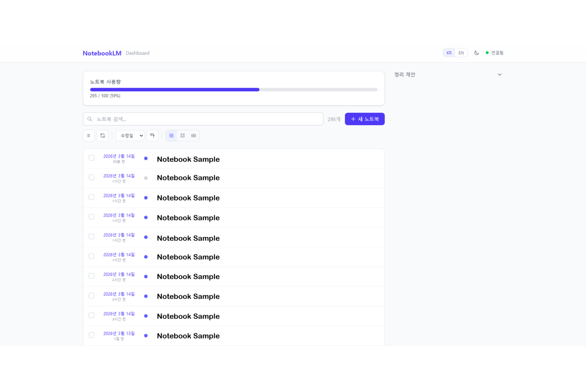
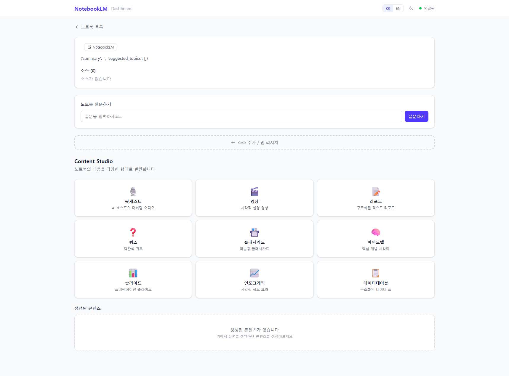
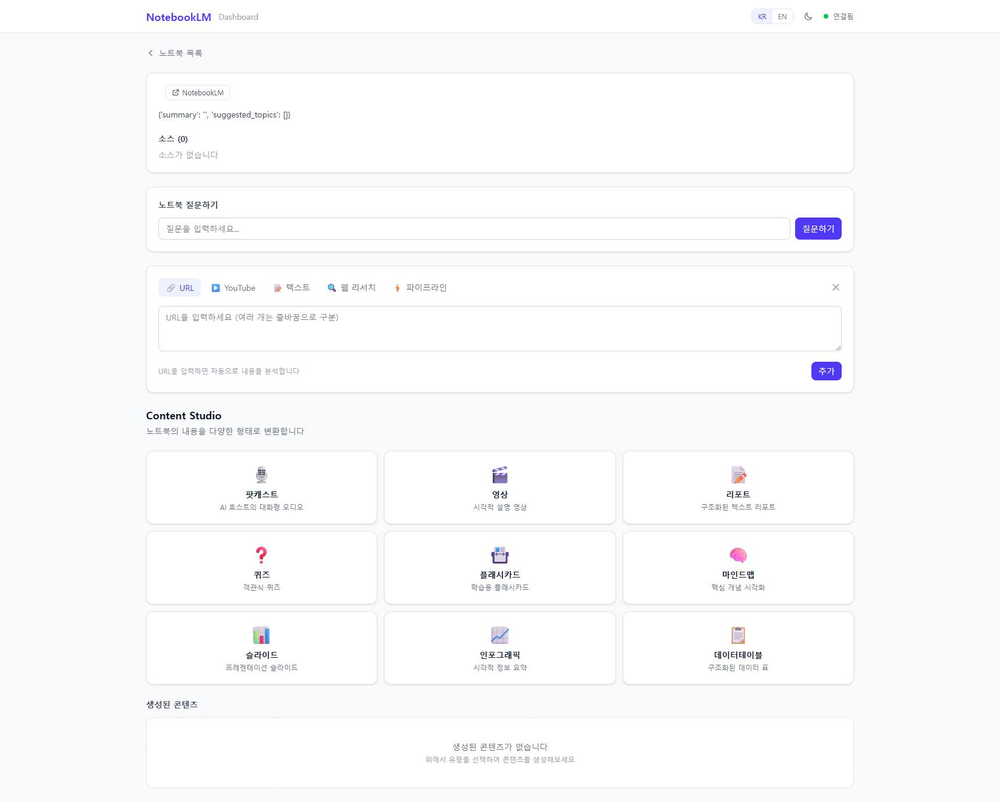
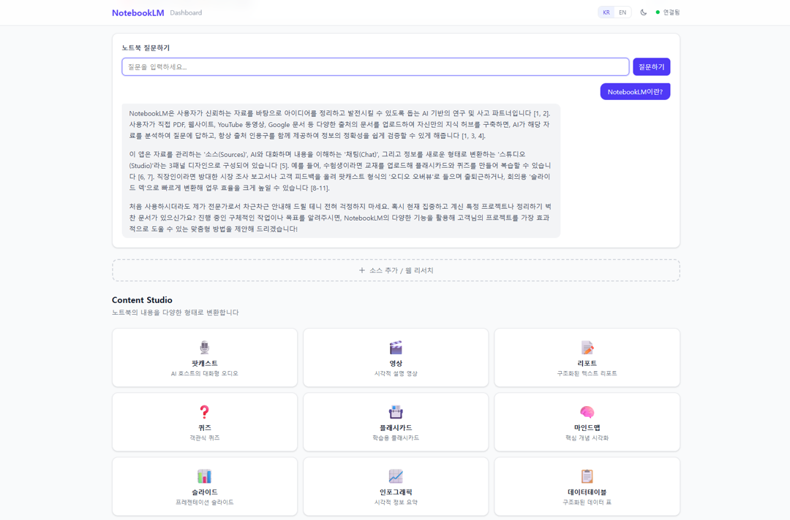

# NotebookLM MCP Dashboard

[](LICENSE)
[](https://react.dev)
[](https://fastapi.tiangolo.com)
[](https://www.typescriptlang.org)
[](https://tailwindcss.com)
[](https://pypi.org/project/notebooklm-mcp-cli/)

**English** | [한국어](README.md)

> A personal web dashboard for managing Google NotebookLM more easily and efficiently. The dashboard UI supports both English and Korean via a language toggle.

A web dashboard built to address common pain points with NotebookLM — no search, no bulk delete, and difficulty managing notebook count limits. It calls the [notebooklm-mcp-cli](https://github.com/PleasePrompto/notebooklm-mcp) CLI as a backend subprocess to access the NotebookLM API.

## Screenshots

<table>
  <tr>
    <td align="center"><b>Notebook List (List View)</b></td>
    <td align="center"><b>Notebook Detail + Content Studio</b></td>
  </tr>
  <tr>
    <td></td>
    <td></td>
  </tr>
  <tr>
    <td align="center"><b>Add Source / Web Research</b></td>
    <td align="center"><b>Notebook Query (Q&A)</b></td>
  </tr>
  <tr>
    <td></td>
    <td></td>
  </tr>
</table>

## Features

### Notebook Management
- **Search & Filter** — Search by title/tag, sort by modified date/created date/name/source count, ascending/descending
- **3 View Modes** — List (timeline), Card, Table
- **Create Notebooks** — Create notebooks directly from the dashboard
- **NotebookLM Link** — Jump to the original NotebookLM page from the notebook detail view

### Bulk Operations
- **Multi-select + Bulk Delete** — Checkbox selection with range selection mode support
- **Bulk Content Creation** — Generate podcasts/videos for multiple selected notebooks at once

### Capacity Management
- **Usage Display** — Current/500 (Pro account) progress bar
- **Smart Cleanup Suggestions** — Auto-recommends old/empty notebooks + one-click delete

### Source Management
- **URL Add** — Add a single URL or multiple URLs at once (newline-separated)
- **YouTube / Text** — YouTube URL input, direct text input
- **Web Research** — Quick/deep mode for searching the web or Google Drive and importing results

### Content Studio
Generate 9 content types + status tracking + download:

| Type | Description |
|------|-------------|
| 🎙 Podcast | deep_dive, brief, critique, debate |
| 🎬 Video | 9 styles including classic, whiteboard, kawaii, anime |
| 📝 Report | Briefing Doc, Study Guide, Blog Post |
| ❓ Quiz | Configurable difficulty and question count |
| 📇 Flashcard | Configurable difficulty and focus |
| 📊 Slides | Edit individual slides after generation |
| 📈 Infographic | Choose orientation and style |
| 🧠 Mind Map | Source-based visualization |
| 📋 Data Table | Description-based structuring |

### Automation
- **One-click Pipeline** — URL → Podcast, Research → Report, Full Content
- **Notebook Query** — Ask questions directly from the dashboard → Markdown answers (with session history)

## Tech Stack

```
Frontend:  React 18 + TypeScript + Vite + TailwindCSS v4 + TanStack Query
Backend:   FastAPI (Python) + nlm CLI async subprocess
Integration: notebooklm-mcp-cli (nlm CLI → Google NotebookLM unofficial API)
```

## Architecture

```
┌─────────────────────────────────────────────────────────┐
│  Browser (localhost:5173 / LAN IP:5173)                 │
│  React + Vite + TailwindCSS + TanStack Query            │
├─────────────────────────────────────────────────────────┤
│  Vite Dev Server (proxy /api → :8000)                   │
├─────────────────────────────────────────────────────────┤
│  FastAPI (0.0.0.0:8000)                                 │
│  NLMClientWrapper: calls nlm CLI via async subprocess   │
├─────────────────────────────────────────────────────────┤
│  nlm CLI (notebooklm-mcp-cli)                           │
│  Google NotebookLM unofficial API                       │
└─────────────────────────────────────────────────────────┘
```

## Quick Start

### 1. Prerequisites

```bash
# Install nlm CLI
uv tool install notebooklm-mcp-cli

# Google authentication
nlm login
```

### 2. Clone & Install

```bash
git clone https://github.com/euisuk-chung/notebooklm-mcp-dashboard.git
cd notebooklm-mcp-dashboard

# Backend
cd backend && uv sync && cd ..

# Frontend
cd frontend && npm install && cd ..
```

### 3. Run

```bash
# Terminal 1: Backend
cd backend
uv run uvicorn app.main:app --reload --host 0.0.0.0 --port 8000 --app-dir src

# Terminal 2: Frontend
cd frontend
npm run dev
```

Open the dashboard at `http://localhost:5173`.

Other devices on the same network can also access it at `http://<your-ip>:5173`.

## API Reference

See [CLAUDE.md](CLAUDE.md) for the full list of API endpoints.

| Category | Key Endpoints |
|----------|---------------|
| Notebooks | `GET/POST /api/notebooks`, `DELETE /{id}`, `POST /bulk-delete`, `POST /{id}/query` |
| Sources | `POST /{id}/sources/url`, `/batch-url`, `/youtube`, `/text`, `/research`, `/pipeline` |
| Studio | `GET/POST /{id}/studio`, `POST /api/studio/bulk-create` |
| Settings | `GET/PATCH /api/settings` |

Swagger UI: `http://localhost:8000/docs`

## Project Structure

```
notebooklm-mcp-dashboard/
├── backend/                # FastAPI server
│   ├── pyproject.toml
│   └── src/app/
│       ├── main.py         # App factory, CORS, routers
│       ├── dependencies.py # NLMClientWrapper (nlm CLI calls)
│       ├── routers/        # auth, notebooks, sources, studio, settings
│       ├── schemas/        # Pydantic models
│       └── services/       # Business logic
├── frontend/               # React app
│   └── src/
│       ├── api/            # API call functions
│       ├── hooks/          # React Query hooks
│       ├── components/     # UI, notebooks, sources, studio
│       ├── pages/          # NotebooksPage, NotebookDetailPage
│       └── utils/          # Constants, formatters
├── docs/                   # notebooklm-mcp-cli original docs
├── notebooklm-mcp/         # Claude Code skills
└── CLAUDE.md               # Detailed architecture docs
```

## Disclaimer

This project uses NotebookLM's **unofficial internal API**. It may change at any time — use for personal/experimental purposes only.

- Cookie-based authentication: requires re-authentication via `nlm login` every 2-4 weeks
- Session expiry: ~20 minutes (a re-authentication prompt is displayed on expiry)
- Pro account notebook limit: 500

## License

[MIT License](LICENSE)
